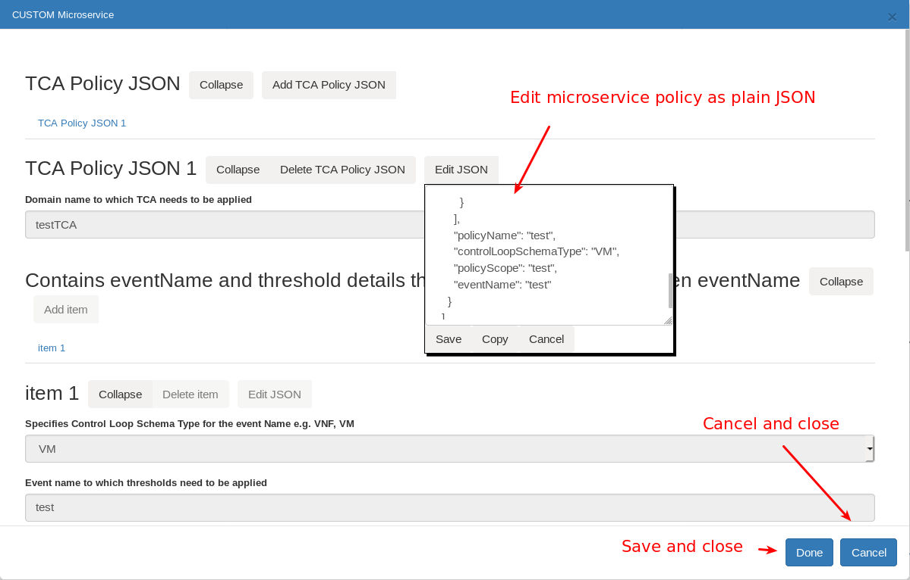
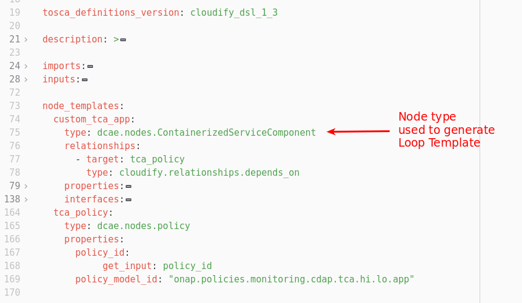

.. This work is licensed under a Creative Commons Attribution 4.0 International License.
.. http://creativecommons.org/licenses/by/4.0
.. Copyright (c) 2017-2018 AT&T Intellectual Property.  All rights reserved.

Closed loop in CLAMP
-------------------------
There is 2 closed loop levels in CLAMP:

- Closed loop template: This is created from the DCAE blueprint (designed in the DCAE designer), and distributed by SDC to CLAMP.
- Closed loop instance: Based on the template, it represents a physical closed loop in the platform related to a service and a VNF.
    This is created in CLAMP when receiving the SDC notification, as this one is related to a specific service/vnf.

There is no way to design a closed loop from scratch in CLAMP, you can only configure it and manage its life-cycle.
For more info on how to design the service in SDC, check this: https://wiki.onap.org/display/DW/CLAMP+videos#CLAMPvideos-DesignpartinSDC

There is a specific menu to open distributed closed loops in CLAMP UI. 

|clamp-open-menu|

Please note that the option "Create CL" can be used to create a closed loop from the template distributed by SDC, you can therefore instantiate it for another service/vnf 

Once you click on "Open CL", this dialog box is shown

|clamp-open-box|

Once the distributed closed loop has been chosen, the closed loop is shown to the user.
From this view user can start configure empty closed loop using **Closed loop modeller**.

|clamp-opened-closed-loop|

Closed loop modeler has 3 main parts:

#. Loop configuration view
    Visualizes event flow in Control Loop. This view is auto-generated by Clamp. To generate it Clamp parses DCAE_INVENTORY_BLUEPRINT from CSAR distributed by SDC.
    It Always consists of **VES -> <nodes from blueprint> -> OperationalPolicy**. Not all nodes are visualized. Only those with type **dcae.nodes.\***
    |blueprint-node|

#. Loop status
    Visualizes status of opened loop.
#. Loop logs
    Table with log data of opened loop

Closed Loop properties
----------------------
In Dublin release this view shows what are deployment parameters or Closed Loop.
To open it from *Closed Loop* menu select *Properties CL*

|clamp-menu-prop|

This opens a box with JSON object. It contains deployment parameters extracted from DCAE_INVENTORY_BLUEPRINT.
It's not recommended to edit this JSON. Each of this parameters should be available in view shown to deploy analytic application.

|clamp-prop-box|

Operational and Guard policy properties
-----------------------------
Operational policy is a parametrized drools (in Dublin) rule with logic performing action on resource.
User can't chose his own rule. Clamp always tries to create operational policy that bases on rule bind with **ClosedLoopControlName** attribute available in Policy dictionary.

There is only one operational policy per closed loop. More about operational policies can be found here `Control Loop Operational Policy <https://wiki.onap.org/display/DW/Control+Loop+Operational+Policy>`_.

Guard policy is policy securing operational policy calls. It defines a set of constraints that have to be matched before running operational policy.
More about guard policies can be found here `Creating and Using Guard Policies <https://docs.onap.org/en/dublin/submodules/policy/engine.git/docs/platform/guardpolicy.html>`_.

To configure operational and guard policy user has to click *OperationalPolicy* box.

Once clicked, it's possible to configure operational policy. Policy can have child policies, one per Recipe.

|clamp-op-policy-box-policy1|

1. Parent policy name
2. Global time limit for this operational policies
3. Specifies whether policy is abated
4. Unique id for Control Loop.
5. Button for creating child/parent policies
6. Unique id of Policy. (Clamp internal)
7. Recipe/Operation triggered on controller/orchestrator
8. Maximum count of retries
9. Timeout for this operational policy
10. Actor used to perform action. (Orchestrator/Controller)
11. Payload required by actor to perform an action
12. Set of fields with policies called under certain conditions. E.g. when health-check receives timeout failure restart could be called.
13. Set of fields specifying resource. On this resource Operational Policy should perform an action
14. Checkbox enabling/disabling guard policy for this operational policy
15. Guard Policy type (frequency limited or min max)
16. Set of guard policy specific fields. Please check `Creating and Using Guard Policies <https://docs.onap.org/en/dublin/submodules/policy/engine.git/docs/platform/guardpolicy.html>`_.

Micro-service policy properties
-------------------------------
Boxes between `VES` and `OperationalPolicy` are generated from blueprint. They can be one of ONAP predefined analytic microservices or custom analytics.
Each of the boxes is clickable. Microservice configuration view is generated using Policy Type assigned to selected microservice.
Clamp by default assumes that microservices have policy type **onap.policies.monitoring.cdap.tca.hi.lo.app**.

After clicking microservice box Clamp opens popup dialog. Example popup dialog for microservice with default type looks like:

|clamp-config-policy-tca1|

|clamp-config-policy-tca2|

Saving Closed loop
------------------
Policies are saved localy in Clamp after each configuration change

Submitting the Closed loop to policy
------------------------------------
In the "Manage Menu", the submit action can be used to send the configuration to policy engine.

|clamp-submit-cl|

If everything is successful, this changes the status to "Submitted". Clamp should also show proper logs in logs view.

|clamp-distributed|

After Policies are submitted they should be visible in Policy PAP component.
Please check  `Policy GUI <https://docs.onap.org/en/dublin/submodules/policy/engine.git/docs/platform/policygui.html>`_

Deploy/undeploy the Closed loop to DCAE 
---------------------------------------
Once sent to policy engine, Clamp can ask to DCAE to deploy the micro service

|clamp-deploy|

This opens a window where the parameters of the DCAE micro service can be configured/tuned.
The policy_id is automatically generated by Clamp in the previous steps.

|clamp-deploy-params|

Once deployed on DCAE the status Closed loop status goes to ACTIVE, it can then be Undeployed/Stopped or even Updated (this is to push new policies on policy engine)

|clamp-undeploy|

.. |clamp-open-menu| image:: images/user-guide/open-menu.png
.. |clamp-open-box| image:: images/user-guide/open-box.png
.. |clamp-opened-closed-loop| image:: images/user-guide/opened-closed-loop.png
.. |clamp-menu-prop| image:: images/user-guide/open-menu-prop.png
.. |clamp-prop-box| image:: images/user-guide/prop-box.png
.. |clamp-op-policy-box-policy1| image:: images/user-guide/op-policy-box-policy1.png
.. |clamp-config-policy-tca1| image:: images/user-guide/config-policy-tca1.png

.. |clamp-submit-cl| image:: images/user-guide/submit-menu.png
.. |clamp-distributed| image:: images/user-guide/distributed.png
.. |clamp-deploy| image:: images/user-guide/deploy.png
.. |clamp-deploy-params| image:: images/user-guide/deploy-params.png
.. |clamp-undeploy| image:: images/user-guide/undeploy.png
