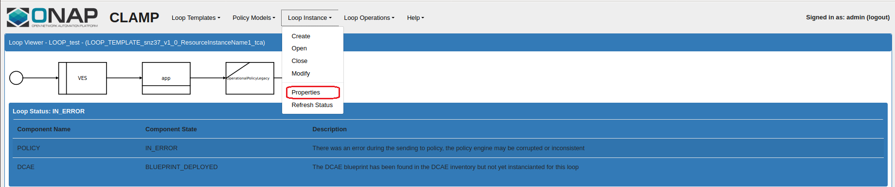

.. This work is licensed under a Creative Commons Attribution 4.0 International License.
.. http://creativecommons.org/licenses/by/4.0
.. Copyright (c) 2017-2018 AT&T Intellectual Property.  All rights reserved.

Open Closed loop in CLAMP
-------------------------
There is 2 closed loop levels in CLAMP:
- Closed loop template: This is created from the DCAE blueprint (designed in the DCAE designer), and distributed by SDC to CLAMP.
- Closed loop instance: Based on the template, it represents a physical closed loop in the platform related to a service and a VNF.
	This is created in CLAMP when receiving the SDC notification, as this one is related to a specific service/vnf.

There is no way to design a closed loop from scratch in CLAMP, you can only configure it and manage its life-cycle.
For more info on how to design the service in SDC, check this: https://wiki.onap.org/display/DW/CLAMP+videos#CLAMPvideos-DesignpartinSDC

There is a specific menu to open distributed closed loops in CLAMP UI. 

|clamp-open-menu|

Please note that the option "Create CL" can be used to create a closed loop from the template distributed by SDC, you can therefore instantiate it for another service/vnf 

Once you click on "Open CL", this dialog box is shown

|clamp-open-box|

Once the distributed closed loop has been chosen, the closed loop is shown to the user

|clamp-opened-closed-loop|

Closed Loop properties
----------------------
You can check to which service/vnf the closed loop has been associated in SDC.

|clamp-menu-prop|

This opens a box that gives the properties set during the SDC notification deployment in CLAMP.
Do not change those settings

|clamp-prop-box|

Operational policy properties
-----------------------------
The box "policy" is clickable, so the operational policies can be defined.
By clicking on the button "New Policy", it's possible to add new operational policies that can chosen in the configuration policy. 

|clamp-op-policy-box|

Once clicked, it's possible to configure each operational policy that can also contain multiple "sub policies", one per Recipe

|clamp-op-policy-box-policy1|

Configuration policy properties
-------------------------------
The box "tca" is clickable, so the TCA configuration policy can be defined.
In that popup dialog, multiple Thresholds can be defined, the operational policies defined previously can be chosen and set in the "Policy" field. 
 
|clamp-config-policy-tca1|

Saving Closed loop
------------------
Once all properties have been defined for all policies, the closed loop must be saved.

|clamp-save-cl|

Submitting the Closed loop to policy
------------------------------------
In the "Manage Menu", the submit action can be used to send the configuration to policy engine.
The "Validation test" can be used to check the data configured in the closed loop without sending anything to policy engine.

|clamp-submit-cl|

If everything is successful, this changes the status to "Distributed" 

|clamp-distributed|

Deploy/undeploy the Closed loop to DCAE 
---------------------------------------
Once sent to policy engine, Clamp can ask to DCAE to deploy the micro service

|clamp-deploy|

This opens a window where the parameters of the DCAE micro service can be configured/tuned.
The policy_id is automatically generated by Clamp in the previous steps.

|clamp-deploy-params|

Once deployed on DCAE the status Closed loop status goes to ACTIVE, it can then be Undeployed/Stopped or even Updated (this is to push new policies on policy engine)

|clamp-undeploy|

.. |clamp-open-menu| image:: images/user-guide/open-menu.png
.. |clamp-open-box| image:: images/user-guide/open-box.png
.. |clamp-opened-closed-loop| image:: images/user-guide/opened-closed-loop.png

.. |clamp-prop-box| image:: images/user-guide/prop-box.png
.. |clamp-op-policy-box| image:: images/user-guide/op-policy-box.png
.. |clamp-op-policy-box-policy1| image:: images/user-guide/op-policy-box-policy1.png
.. |clamp-config-policy-tca1| image:: images/user-guide/config-policy-tca1.png
.. |clamp-save-cl| image:: images/user-guide/save-cl.png
.. |clamp-submit-cl| image:: images/user-guide/submit-menu.png
.. |clamp-distributed| image:: images/user-guide/distributed.png
.. |clamp-deploy| image:: images/user-guide/deploy.png
.. |clamp-deploy-params| image:: images/user-guide/deploy-params.png
.. |clamp-undeploy| image:: images/user-guide/undeploy.png